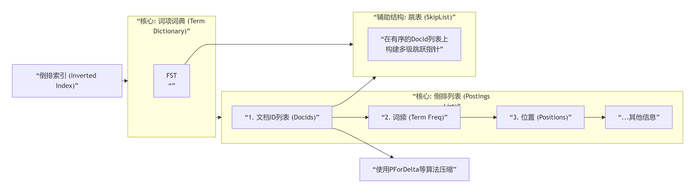

# Elastic Stack 基本概念

#### 学习和了解Elastic Stack的基本概念，可以帮助我们更好的了解Elastic Stack设计理念、应用场景，以及如何更好的部署、规划、使用Elastic Stack，真正做到"知己知彼，百战不殆"

#### Elastic Stack产品矩阵
- **Elasticsearch：分布式数据存储和搜索引擎，可处理索引、查询和分析，是Elastic Stack的核心和发动机**
- **Kibana：仪表盘、可视化和管理工具的可视化界面**
- **Logstash：数据摄取和转换引擎，通常用于更复杂的 ETL（提取、转换、加载）管道**
- **Elastic Agent：一个轻量级的数据传输器，用于收集数据并将其转发到 Elasticsearch，现已替代Beats**
- **Beats：Elastic Agent没有出来之前的主流数据传输器，主要有Filebeat、Metricbeat、Auditbeat、Heartbeat、Packetbeat、Winlogbeat**
- **APM(应用性能监控)：它能够实时监控软件服务和应用程序，收集关于传入请求、数据库查询、缓存调用、外部 HTTP 请求等的详细性能信息，从而帮助您快速定位并修复性能问题**
- **Elasticsearch Hadoop：它是一个与Hadoop、Elasticsearch之间进行数据交互的一种工具**

#### Elasticsearch 基本概念
- **集群：一组由不同角色的Elasticsearch 节点组成的集合**
- **节点：不同角色的Elasticsearch 节点，一般生产集群最少3节点**
- **分片：存放索引数据的子集，比如一个索引有3个分片，那么每个分片存放1/3数据**
- **副本：分片的副本，分片高可用、只读数据的来源**
- **索引：存储、检索、组织数据的逻辑容器**
- **文档：Elasticsearch的基本存储单元，类似于MYSQL的行**
- **字段：Elasticsearch的最小数据单元，类似于MYSQL的列**
- **映射：Elasticsearch的存储数据结构，类似于MYSQL的表结构**
- **分词：构建倒排索引的基本，比如："我是中国人"，分词："我"、"是"、"中国"、"人"**
- **JSON：Elasticsearch的存储、返回格式**

#### Elasticsearch、Kibana查询语言(数据写入/更新/删除操作须通过PUT、POST _bulk、POST _update_by_query等接口操作)
- **Query DSL：原生的JSON风格语言，支持复杂查询**
- **ES|QL：用于过滤、转换和分析数据的一种管道查询语言，支持JOIN、支持跨集群**
- **EQL：基于时间序列、事件序列（例如日志、指标和跟踪）的查询语言**
- **Elasticsearch SQL：类似于SQL语法的查询，底层自动转换成Query DSL**
- **KQL(Kibana Query Language)：基于Kibana UI的查询语言，可以通过Kibana UI界面操作自动生成查询、过滤数据**
- **Lucene query syntax：基于Apache Lucene的基本搜索、简单过滤的原始查询语法**

#### Elasticsearch 常用数据类型：keyword、Number、Date、Text、Boolean、Object、Geo_point

#### Elasticsearch CRUD常用操作语法("POST _bulk API"是高效率写入的核心，可以在一个请求中混合执行索引、创建、更新、删除等多种操作)
- **查询：match、multi_match、term、terms、range、exists、bool、filter、geo_distance、geo_bounding_box等**
- **插入："PUT /index/_doc/1"、"POST _bulk"**
- **更新："POST /<index>/_update/<id>"、"POST /<index>/_update_by_query"、"POST _bulk"**
- **删除："DELETE /<index>/_doc/<id>"、"POST /<index>/_delete_by_query"、"POST _bulk"**

#### Elasticsearch 倒排索引结构

#### Elasticsearch 节点角色类型
- **master：候选主节点，简称：m，作用：可以被选为主节点的节点**
- **data(传统角色，为了向后兼容，等同于：data_content + data_hot + data_warm + data_cold + data_frozen)：数据节点，简称：d，作用：保存数据并执行CRUD、搜索、聚合的节点**
- **data_content：内容数据节点，简称：s，作用：负责存储、搜索的数据节点**
- **data_hot：热数据节点，简称：h，作用：最近、最常访问的数据节点，此节点必须与data_content角色一起使用**
- **data_warm：温数据节点，简称：w，作用：访问频次低、很少更新数据节点，此节点必须与data_content角色一起使用**
- **data_cold：冷数据节点，简称：c，作用：不经常访问、通常不更新的数据节点，此节点必须与data_content角色一起使用**
- **data_frozen：冻结数据节点（只读、归档数据），简称：f，作用：很少访问、从不更新的数据节点，此节点必须与data_content角色一起使用**
- **ingest：采集节点（数据处理管道），简称：i，作用：执行由预处理管道组成的预处理任务，比如ETL**
- **remote_cluster_client：远程集群客户端节点，简称：r，作用：用于跨集群检索、跨集群复制**
- **l：机器学习节点，简称：l，作用：运行job并处理机器学习API请求**
- **transform：转换节点，简称：t，作用：运行转换并处理转换API请求**
- **voting_only：仅投票主节点（7.3+），简称：v，作用：仅参与投票选举master的节点，自己不能成为主节点**
- **coordinating_only：仅协调节点（不配置任何角色时），简称："-"，作用：负责路由分发请求、聚拢（或叫作收集，可理解为分发的反过程）搜索或聚合结果**

#### Elasticsearch 内置用户(elasticsearch-reset-password：用于生成、修改用户密码的内置工具)
- **elastic：ES超级用户**
- **kibana_system：Kibana 与 Elasticsearch连接和通信的用户**
- **logstash_system：Logstash 与 Elasticsearch中存储监控信息时使用的用户**
- **beats_system：Beats 与 Elasticsearch 中存储监控信息时使用的用户**
- **apm_system：APM服务器 与 Elasticsearch 中存储监控信息时使用的用户**
- **remote_monitoring_user：Metricbeat 在 Elasticsearch 中收集和存储监控信息时使用的用户。它具有 remote_monitoring_agent 和 remote_monitoring_collector 内置角色**

#### Elasticsearch JVM堆内内存："-Xms、-Xmx"，存储索引中的文档数据、聚合计算的中间结果  通过垃圾回收器(GC)进行回收，设置为系统物理内存的 50%，但绝对不要超过 32GB，因为64位系统中，如果堆内存小于32GB，JVM 可以使用内存指针压缩技术（Compressed OOPs），节省大量内存并提升性能。超过这个阈值，优势就会丧失

#### Elasticsearch 搜索结果质量指标(100件连衣裙，有20件是夏季连衣裙，通过搜索返回了50条，其中20条都是夏季连衣裙)
- **召回率：查的全不全，找出所有相关文档的比例，召回率=系统找到的相关文档数 / 系统中所有存在的相关文档总数，上面的例子，召回率=50/20=100%**
- **精准率：查的准不准，返回结果中真正相关的比例，精准率 = 系统找到的相关文档数 / 系统返回的所有文档总数，上面的例子，精准率=20/50=40%**

##### 至此，Elastic Stack 基本概念就介绍完成了，请开始你的表演吧！

&nbsp;

**有兴趣的小伙伴，可加联系方式：Telegram：@dean_code**  
